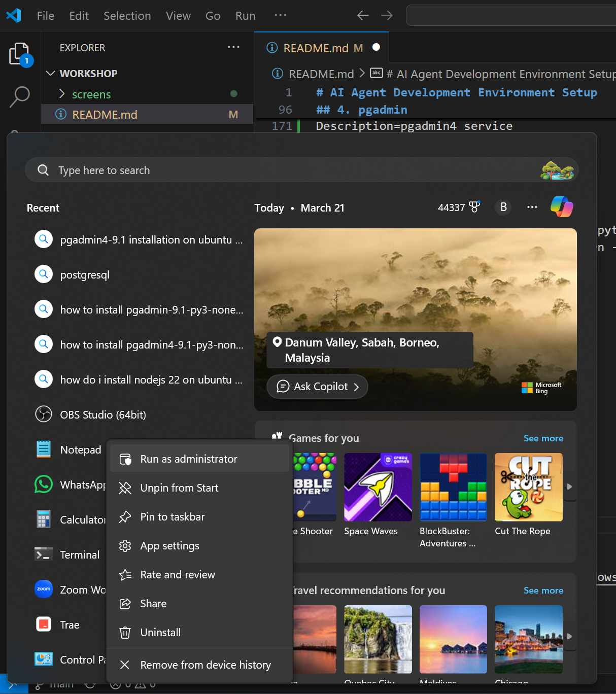
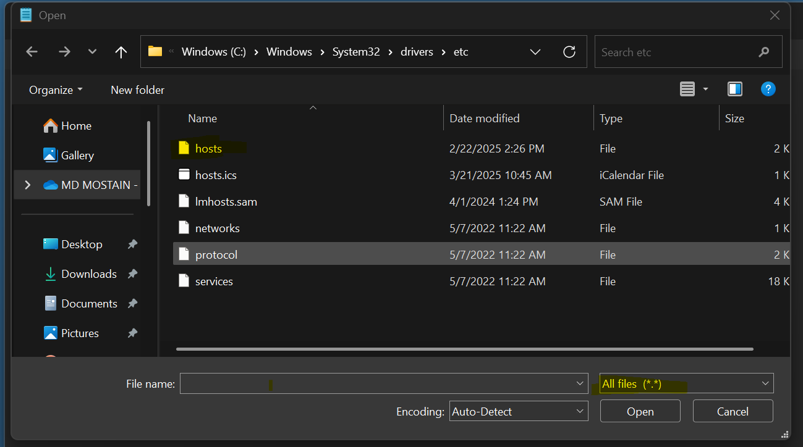
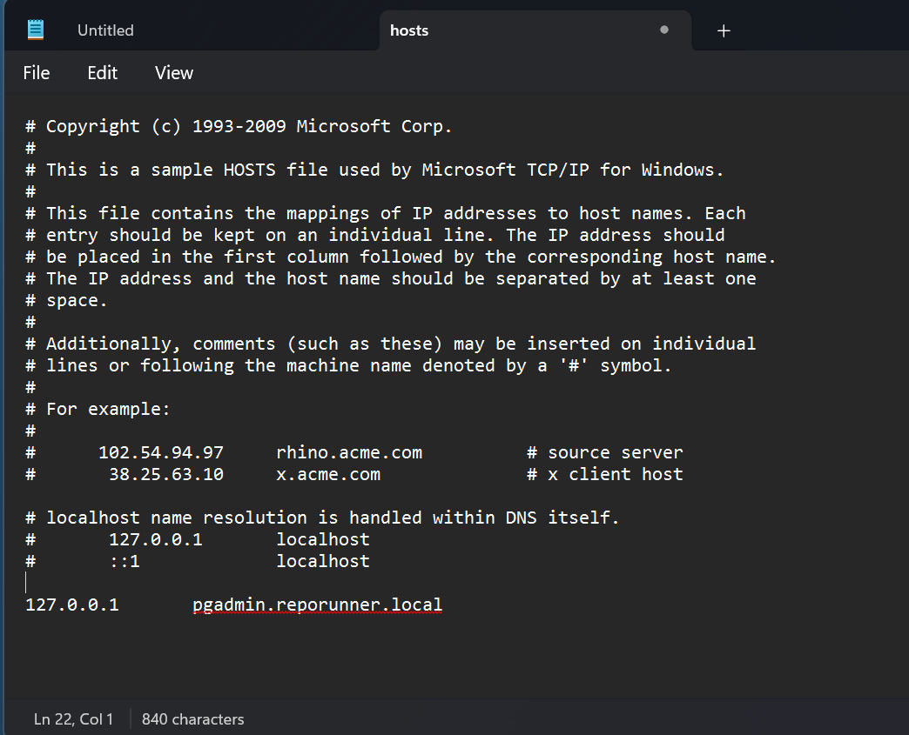
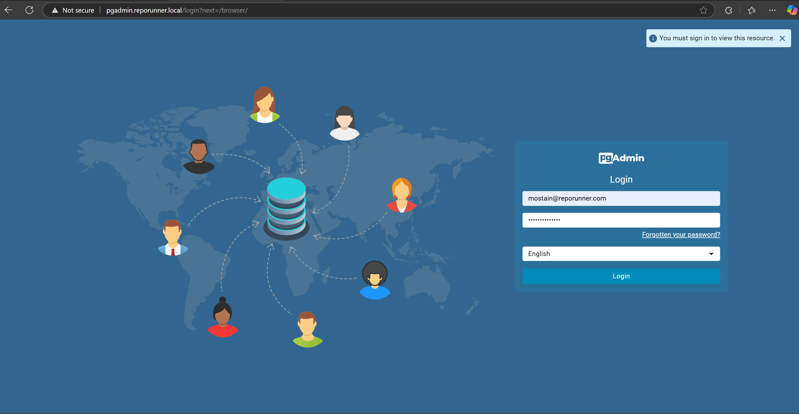
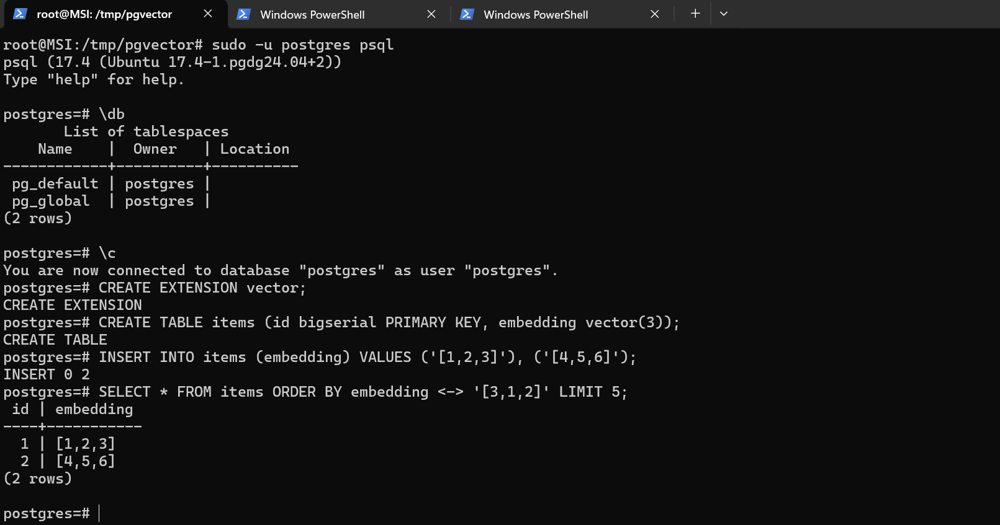

# AI Agent Development Environment Setup

## Operating System
* Linux
* Windows | WSL
* Mac

1. WSL
    * wsl --install -d `<Distro>`
    * wsl --list --online
    * wsl -l -v
    * wsl pwd
    * wsl --install -d Ubuntu-24.04

2. NodeJS
3. PostgreSQL
4. pgadmin
5. pgvector
6. n8n

## 1. WSL Installation

> *Step-1*: Install Ubuntu-24.04 on Windows with WSL -> `wsl --install -d Ubuntu-24.04`


এই ধাপে ৫ মিনিট থেকে ৩০ মিনিট পর্যন্ত অপেক্ষা করতে হতে পারে (আপনার ইন্টারনেট স্পিড এর উপর নির্ভরশীল)
> 

> *Step-2*: `wsl -d Ubuntu-24.04`


এই স্টেপে সিস্টেম আপনার কাছে ইউসার ও পাসওয়ার্ড চাইবে এবং পরবর্তিতে এই ইউসার এবং পাসওয়ার্ড ব্যবহার করেই আপনাকে WSL সিস্টেমে লগইন করবেন

বাই ডিফল্ট যে ইউসার তৈরী করেছেন সেটি দিয়ে লগইন হবে কিন্তু আপনি চাইলে রুট ইউসার হিসেবেও লগইন করতে পারবেন সেজন্য নিচের কমান্ডটি ব্যবহার করুন

> `wsl -d Ubuntu-24.04 -u root`

এর পর রুট ডিরেক্টরিতে যাবার জন্য `cd` লিখে কীবোর্ড এর `এন্টার` কী প্রেস করুন

> সবশেষে হোমডিরেক্টরিতে `.wslconfig` নামে একটি ফাইল তৈরী করে নিচের কনটেন্ট লিখে সেভ করুন (নিচের কমান্ডটি প্রয়োগ করে নোটপ্যাডে .wslconfig ওপেন হলে কনটেন্ট কপি পেস্ট করে সেভ করুন)

> 
> `notepad .wslconfig`
```
[wsl2]
localhostForwarding = true
networkingMode = NAT
dnsProxy = true
firewall = true
dnsTunneling = false
```


## 2. NodeJS
আমরা যেহতু WSL এর মাধ্যমে অপারেটিং সিস্টেম লিনাক্স এর Ubuntu-24.04 ডিস্ট্রো ব্যবহার করছি সুতরাং নিচের কমান্ড গুলো ক্রমান্নয়ে প্রয়োগের মাধ্যমে NodeJS ইনস্টলেশন সম্পন্ন করব

> `apt install -y ca-certificates curl gnupg`

> `mkdir -p /etc/apt/keyrings`

> `curl -fsSL https://deb.nodesource.com/gpgkey/nodesource-repo.gpg.key | gpg --dearmor -o /etc/apt/keyrings/nodesource.gpg`

> `echo "deb [signed-by=/etc/apt/keyrings/nodesource.gpg] https://deb.nodesource.com/node_22.x nodistro main" | sudo tee /etc/apt/sources.list.d/nodesource.list`

> `apt update`

> `apt install nodejs -y`

> `nodejs --version`

উপরের কমান্ড গুলো যদি সব ঠিক মত রান করে থাকেন তবে নিচের স্ক্রীনে দেখানো আউটপুট দেখা যাবে


## 3. PostgreSQL
PostgreSQL ডেটাবেজ সার্ভার ইনস্টলেশনের জন্য নিচের কমান্ডগুলো ক্রমান্নয়ে প্রয়োগ করুন

> `apt install gnupg2 -y`

> `echo "deb http://apt.postgresql.org/pub/repos/apt $(lsb_release -cs)-pgdg main" > /etc/apt/sources.list.d/pgdg.list`

> `curl -fsSL https://www.postgresql.org/media/keys/ACCC4CF8.asc | sudo gpg --dearmor -o /etc/apt/trusted.gpg.d/postgresql.gpg`

> `apt update -y`

> `apt install postgresql-17 postgresql-contrib-17 -y`

> `systemctl enable postgresql`

> `psql --version`

উপরের কমান্ড গুলো যদি সব ঠিক মত রান করে থাকেন তবে নিচের স্ক্রীনে দেখানো আউটপুট দেখা যাবে


## 4. pgadmin
> `apt install libgmp3-dev libpq-dev -y`

> `python3 -V`
> 

> `apt install python3.12-venv -y`

> `mkdir -p /var/log/pgadmin4`
> `mkdir -p /var/lib/pgadmin4/sessions`
> `mkdir -p /var/lib/pgadmin4/storage`
> `mkdir -p /var/lib/pgadmin4/azurecredentialcache`

> `mkdir -p /opt/pgadmin`

> `python3 -m venv /opt/pgadmin/.venv`

> `/opt/pgadmin/.venv/bin/python -m pip install -U pip`

> `/opt/pgadmin/.venv/bin/python -m pip install --upgrade pip setuptools wheel`

> `wget https://ftp.postgresql.org/pub/pgadmin/pgadmin4/v9.1/pip/pgadmin4-9.1-py3-none-any.whl -P /opt/pgadmin`

> `source /opt/pgadmin/.venv/bin/activate`

> `pip3 install pgadmin4-9.1-py3-none-any.whl`

> `deactivate`

> `/opt/pgadmin/.venv/bin/pip install gunicorn`


> `nano /opt/pgadmin/.venv/lib/python3.12/site-packages/pgadmin4/config_local.py`

```
LOG_FILE = '/var/log/pgadmin4/pgadmin4.log'
SQLITE_PATH = '/var/lib/pgadmin4/pgadmin4.db'
SESSION_DB_PATH = '/var/lib/pgadmin4/sessions'
STORAGE_DIR = '/var/lib/pgadmin4/storage'
AZURE_CREDENTIAL_CACHE_DIR = '/var/lib/pgadmin4/azurecredentialcache'
SERVER_MODE = True
```


> `/opt/pgadmin/.venv/bin/python /opt/pgadmin/.venv/lib/python3.12/site-packages/pgadmin4/setup.py setup-db`
> 
```
Email address: mostain@reporunner.com
Password: Bangladesh2025
Retype password: Bangladesh2025
```

> `/opt/pgadmin/.venv/bin/python /opt/pgadmin/.venv/lib/python3.12/site-packages/pgadmin4/setup.py get-users`
> 


> `apt install nginx -y`

> `nano /etc/nginx/sites-available/pgadmin.reporunner.local`
```
server {
    listen 8080;
    listen [::]:80;
    server_name pgadmin.reporunner.local;
    location / {
        proxy_pass http://unix:/tmp/pgadmin4.sock;
        include proxy_params;
    }
}
```

> `nano /etc/systemd/system/pgadmin4.service`

```
[Unit]
Description=pgadmin4 service
After=syslog.target network.target

[Service]
Type=simple
User=root
WorkingDirectory=/opt/pgadmin/.venv/lib/python3.12/site-packages/pgadmin4
ExecStart=/opt/pgadmin/.venv/bin/gunicorn --bind unix:/tmp/pgadmin4.sock --workers=1 --threads=25 pgAdmin4:app

Restart=on-abort

[Install]
WantedBy=multi-user.target
```

> `systemctl daemon-reload`

> `systemctl enable pgadmin4`

> `systemctl start pgadmin4`

> `systemctl status pgadmin4`

## `DNS Entry`

> নোটপ্যাড এডমিনিস্ট্রেটর মোড এ ওপেন করুন
> 

> এই `C:\Windows\System32\drivers\etc` লোকেশনে গিয়ে `hosts` ফাইলটি ওপেন করুন
> 

> নিচের ছবির মত `pgadmin.reporunner.local` লাইনটি সংযুক্ত করুন 
> 

> আপনার পছন্দের ব্রাউসার ওপেন করে এড্রেস বারে `http://pgadmin.reporunner.local` টাইপ করে এন্টার প্রেস করলেই নিচের স্ক্রিন দেখতে পাবেন
> 

## 5. pgvector

> `apt install make`

> `apt install gcc -y`

> `apt install postgresql-server-dev-all -y`

> `cd /tmp`

> `git clone --branch v0.8.0 https://github.com/pgvector/pgvector.git`

> `cd pgvector`

> `make`

> `make install`

সফলভাবে **pgvector** ইনস্টল হয়েছে কিনা চেক করতে নিচের কমান্ড গুলোর ক্রমান্নয়ে প্রয়োগ করুন
> `sudo -u postgres psql`

> `CREATE EXTENSION vector;`

> `CREATE TABLE items (id bigserial PRIMARY KEY, embedding vector(3));`

> `INSERT INTO items (embedding) VALUES ('[1,2,3]'), ('[4,5,6]');`

> `SELECT * FROM items ORDER BY embedding <-> '[3,1,2]' LIMIT 5;`

> `\dx` or `select extname from pg_extension;`

সবঠিক থাকলে নিচের স্ক্রিন দেখতে পাবেন
> 

## Resource Link
* https://learn.microsoft.com/en-us/windows/wsl/install
* https://github.com/pgvector/pgvector
* https://www.postgresql.org/docs/current/view-pg-available-extensions.html
* https://ollama.com